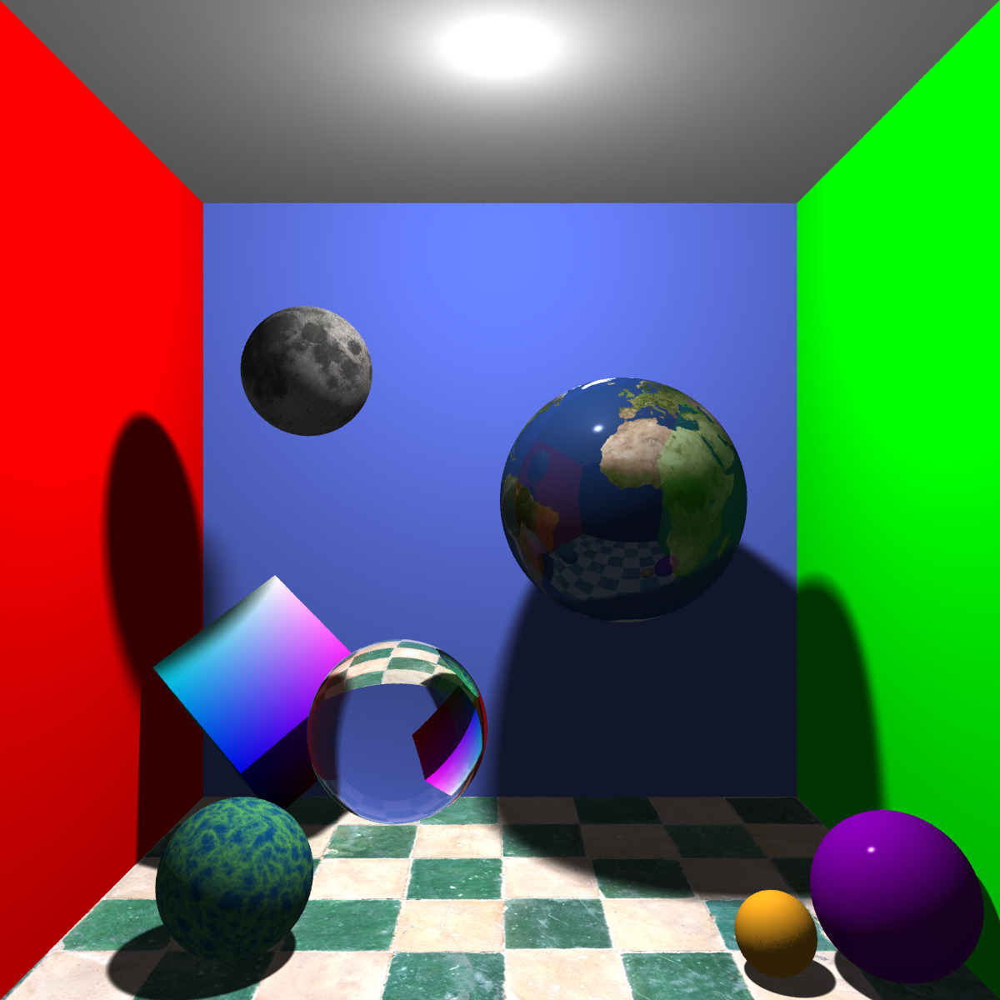
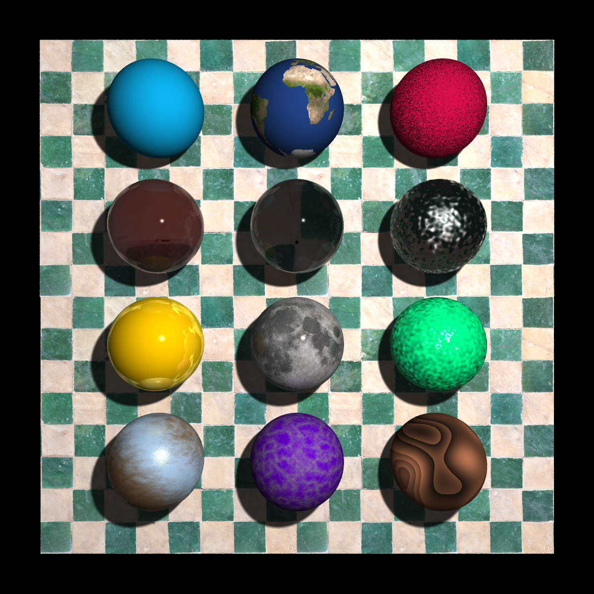

# Basic Raytracer
## Features
- Recursive backwards ray tracing
- Phong Illumination
- Refractive/Reflective materials
- Anti-aliasing 
- Soft shadows (area light)
- Bounding volume hierarchy for faster intersection tests
- UV texture mapping
- Procedural textures using Perlin noise
- Procedural normal mapping using Perlin noise
- Triangles, Spheres, Planes, Cubes

